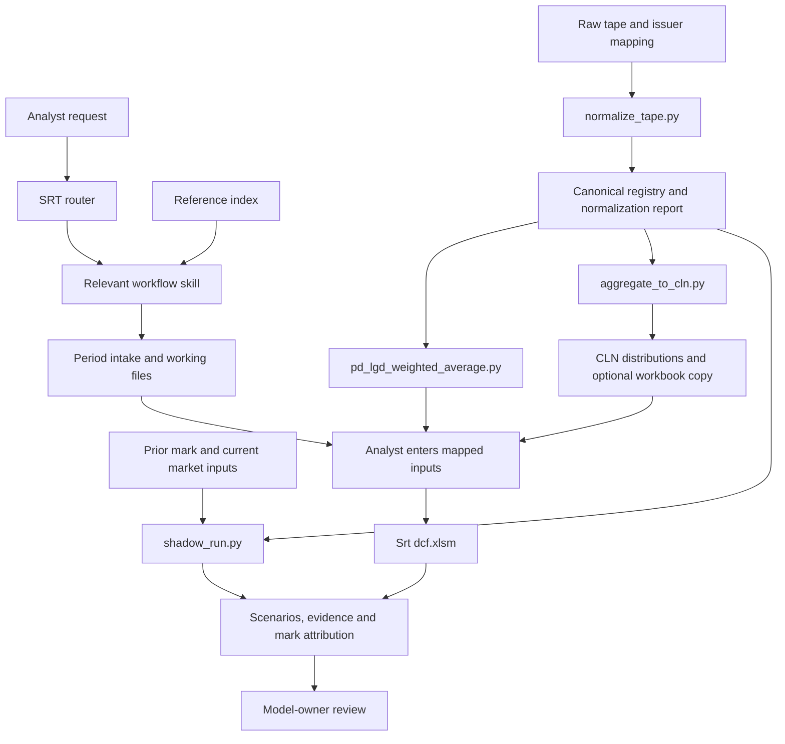

# Architecture

The toolkit has three working layers: workflow instructions, deterministic preparation scripts, and the analyst's Excel model. The transaction documents supply the legal terms; the [process](../assets/srt/references/process.md) supplies the sequence; `Srt dcf.xlsm` supplies the valuation calculation.

The arrows show the workflow. The Python modules do not execute the Excel model or orchestrate a complete quarterly run.

## Workflow instructions

[AGENTS.md](../AGENTS.md) sets the operating requirements. [CLAUDE.md](../CLAUDE.md) provides the Claude entry point. The [router](../skills/srt-quarterly-update/SKILL.md) selects one of seven skills for calibration, legal terms, registry inputs, quarterly model updates, evidence and attribution, conceptual questions or the correlation exhibit.

Each skill begins with one reference selected through [reference-load-index.md](../assets/srt/reference-load-index.md). This keeps a registry question focused on registry requirements, while allowing the host to load another reference when a question crosses topics. See [the skill guide](tools/skills.md).

## Preparation scripts

| Module | Responsibility |
|---|---|
| `normalize_tape.py` | Read CSV or XLSX using a JSON mapping; standardize field names and units; report required-field, range and notional exceptions; write the canonical CSV. |
| `pd_lgd_weighted_average.py` | Read a CSV and print exposure-weighted PD, recovery and LGD for the selected population. |
| `aggregate_to_cln.py` | Read a CSV and a separate CLN mapping; produce rating, loan-type and geography distributions and parameter-table self-checks; optionally write a CLN copy. |
| `shadow_run.py` | Read a canonical registry and prior/current assumptions; estimate the movement and compare it with an optional recorded mark. |

The normalizer supplies consistent fields for downstream tools. The aggregation mapping still needs to identify the actual rating and loan-type columns in the chosen CSV. Its `choose_path` function expresses the prior-methodology decision, but the aggregation command does not call that function; the skill and analyst perform that decision before using the script. [Command details](tools/scripts.md) describe this boundary and the output fields.

## Workbook interface

`assets/srt/corpus.map.json` locates the locally supplied workbooks and period files. Before model entries, the analyst reads the [cell map](../assets/srt/references/model-cell-map.md), confirms the workbook contract and makes a period copy. The normal quarterly workflow preserves the formulas, named ranges, `Collateral` and `Notes` engines, and the origination calibration.

The optional CLN writer receives its destination through `--cln`. It saves input distributions in a workbook copy and retains formula cells. Its openpyxl save does not retain add-in connections or charts, and does not recalculate Excel formulas. Open the copy in Excel for calculation and inspect the output before carrying values into the SRT model.

The shadow bridge is an approximation: an additive DM change, a linear expected-loss scaling of prior writedown, a spread-duration price effect and a zero rate leg. The workbook retains its own cash-flow and multiplier calculations. Use each output for its stated purpose.

## Evidence and checks

The [templates](../assets/srt/templates/) provide an evidence log, exception log, mark attribution and run state. The workflow ties inputs to their sources and explains each tranche's current-versus-prior change. Missing permissions, unresolved required inputs, an unverified vendor refresh or a methodology change require the response specified in the operating references.

The [tests](../TESTING.md) exercise the preparation modules, selected stop conditions, package structure and model contracts. The [sandbox cases](tools/tests-and-sandbox.md) supply synthetic material for running helpers and practicing the procedure. The final valuation uses the workbook output and recorded model-owner approval.
